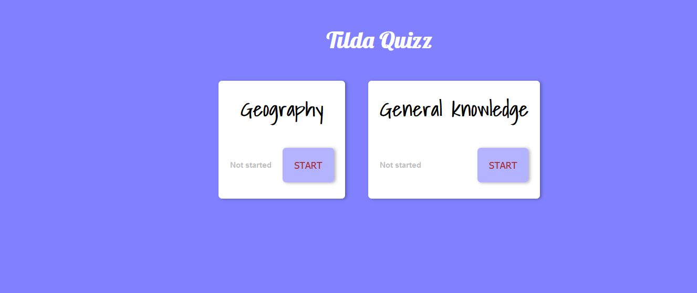
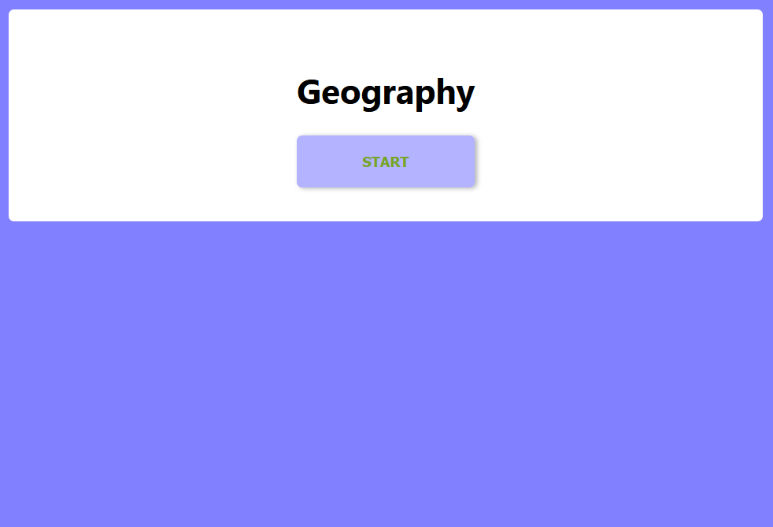
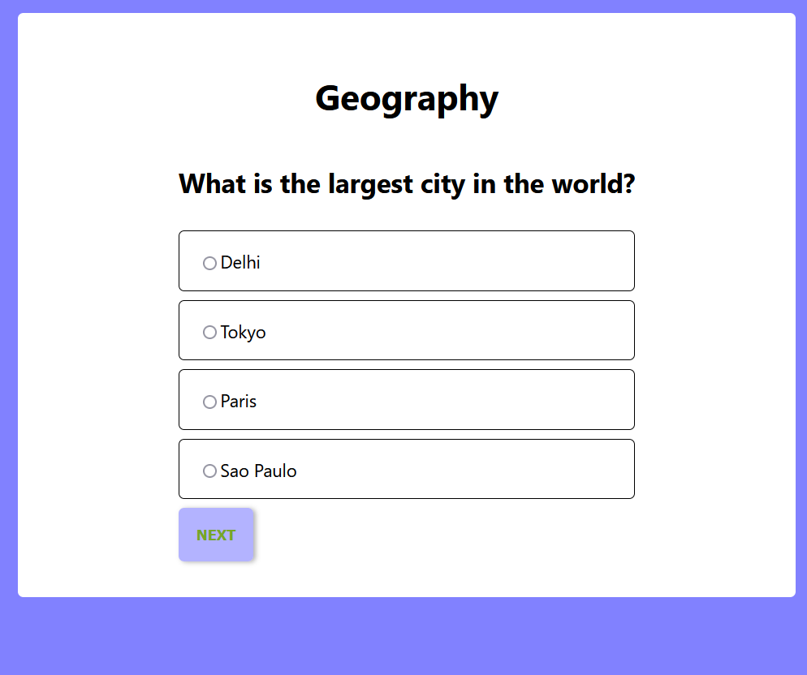

# Tilda Quizz

 

## Getting started 
### Front end
1. Open the client folder and run in the terminal. \
    `npm i` 
2. Start the app by typing \
   `npm start`

## Tech stack
### Front end
- [React](https://reactjs.org/)
- [TypeScript](https://www.typescriptlang.org/)
- [ApolloClient](https://www.apollographql.com/)
